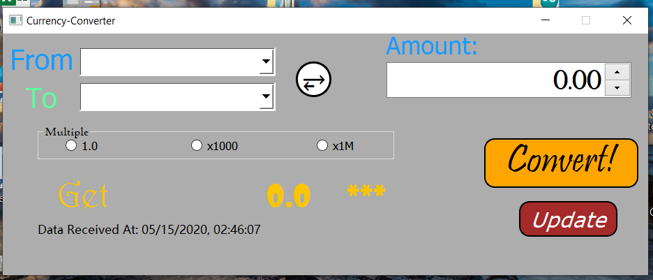
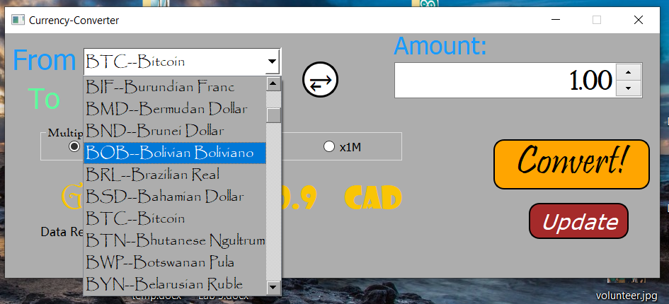
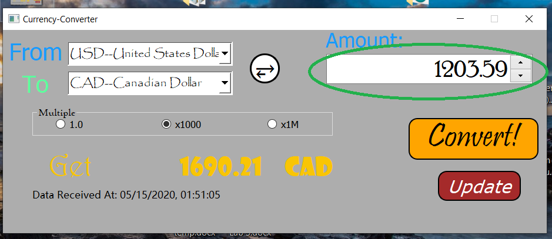
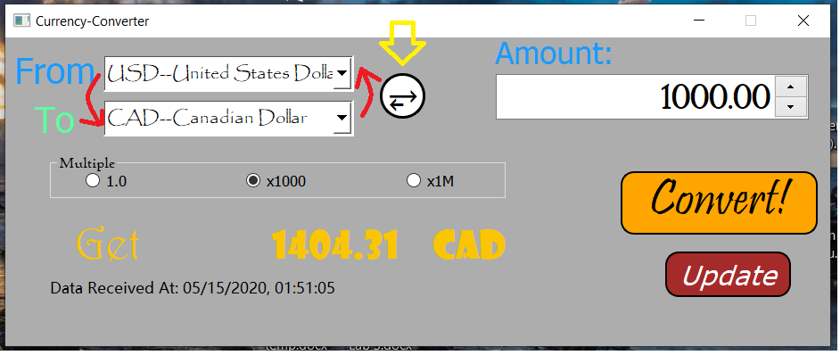
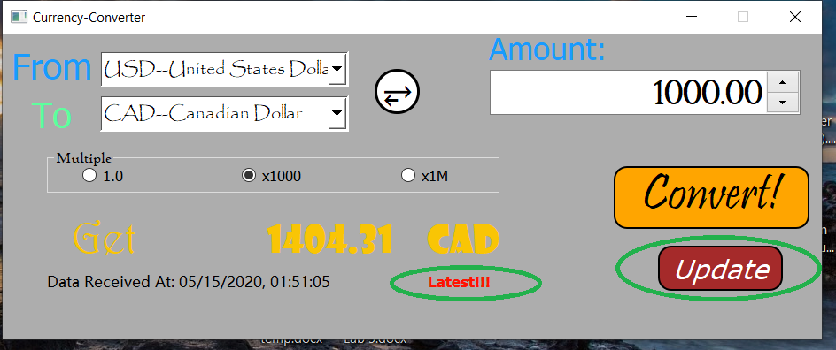

#This is a real-time currency converter tool. 

The technique behind it actually dealing with json data retrived online.

Here are some screenshots to illustate it:

1. browse and choose the base currency from FROM combo-box with a list of more than 100 currencies

2. browse the target currency from TO combo-box

3. successfully converted after clicking on 'click' button  

  tip: you can choose a base multiple value if you do not want to type 1/1_000/1_000_000

4. Reverse betweent two selected currencies (remeber to click "convert" to commit the change)

5. Update to the latest currency rate by clicking 'update'! (The label 'Latest!!!' will remain for 3 seconds to notify a successful data updation)

**<a href="https://algonquinlivecom-my.sharepoint.com/personal/jian0088_algonquinlive_com/_layouts/15/onedrive.aspx?id=%2Fpersonal%2Fjian0088%5Falgonquinlive%5Fcom%2FDocuments%2FCurrency%5FConverter%2Eexe&parent=%2Fpersonal%2Fjian0088%5Falgonquinlive%5Fcom%2FDocuments&originalPath=aHR0cHM6Ly9hbGdvbnF1aW5saXZlY29tLW15LnNoYXJlcG9pbnQuY29tLzp1Oi9nL3BlcnNvbmFsL2ppYW4wMDg4X2FsZ29ucXVpbmxpdmVfY29tL0VlbzM1bmY4TmxwR2tkRndzYXFyWHBJQnpEakFYNjZNcE1WbldlZm83cW1zLWc_cnRpbWU9R1gtd0t6TE8xMGc">Download it here!</a>** 

**if no network, it will tell you to restart and try**

